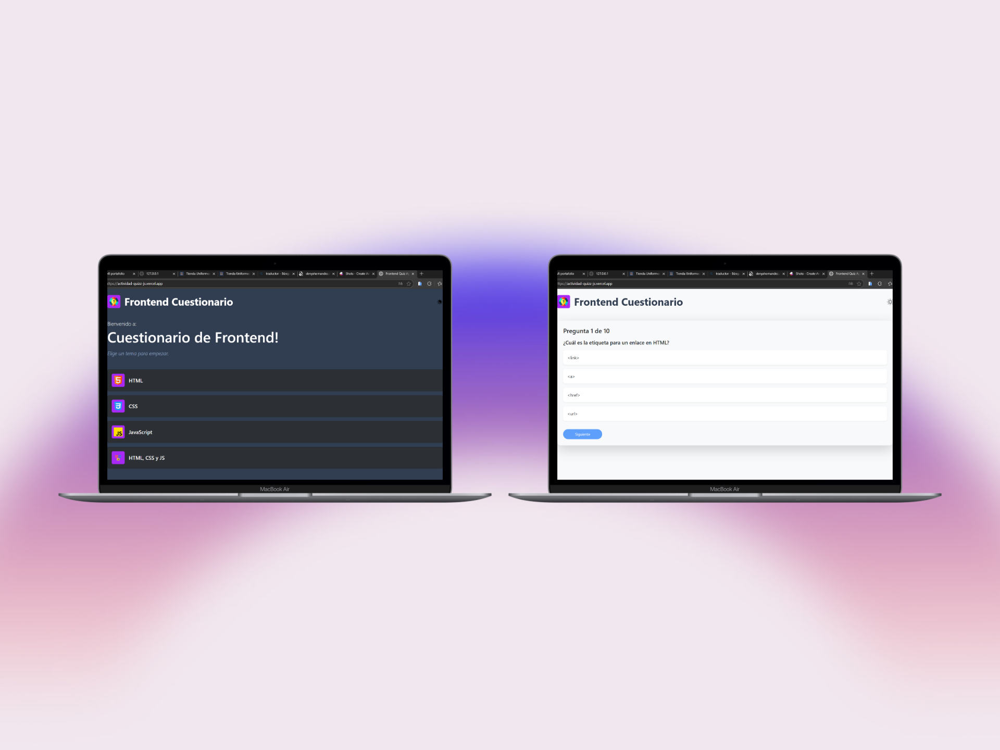
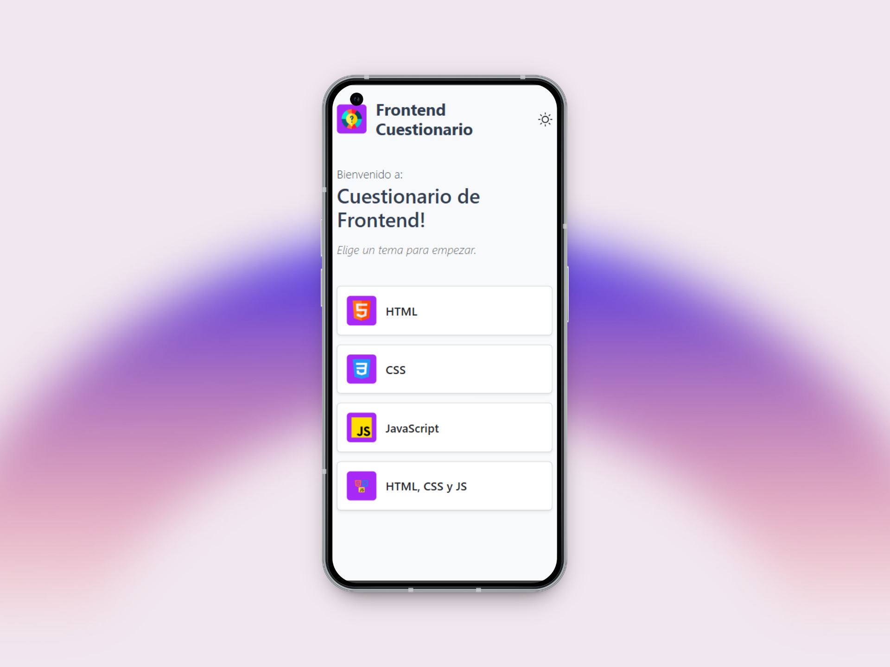

# Actividad-QuizzJS

**Actividad de Bootcamp Full Stack Junior (FSJ28)** 
Creación de una página web utilizando el DOM

GRUPO 1:
- Bryan Alexander Díaz Vásquez
- Luis Alejandro Ramos Ordoñez
- Denys Alexander Hernández Maravilla
- Jonatan Ernesto Segura Reymundo

## ☕ Proyecto: Actividad-QuizzJS

Este proyecto consiste en una aplicación web tipo **cuestionario interactivo**, donde el usuario responde preguntas de selección múltiple y recibe una puntuación al finalizar. Fue desarrollado con tecnologías web básicas y buenas prácticas de diseño modular.

### 🧠 Lo que aprendí:
- Interfaz dinámica con HTML, CSS y JavaScript Vanilla
- Cambios de pantalla entre bienvenida, preguntas y resultados
- Alerta de resultado final con **SweetAlert2**
- Diseño responsivo usando **Bootstrap**
- Separación de preguntas por tema en un archivo JS

### 🌐 Enlace al proyecto:
[🔗 https://actividad-quizz-js.vercel.app/)

### 📸 Capturas del proyecto:

  
  

